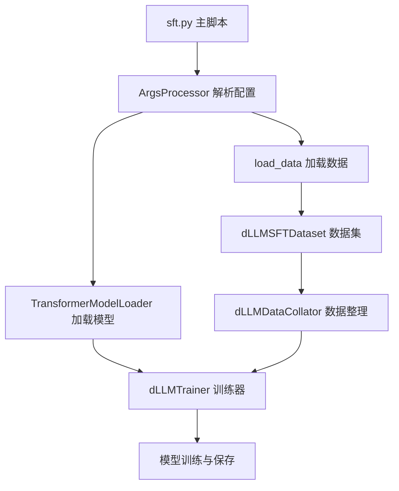

# dLLM-Factory SFT框架详细分析报告

## 概述

本报告详细分析了 `/mnt/40t/zhounan/dLLM-Factory-main/sft/` 目录的结构和功能，为用户提供全面的微调框架使用指南。该框架基于扩散模型（Diffusion Model）的语言模型微调方法，提供了完整的监督微调（SFT）解决方案。

---

## 1. 目录结构概览

```
sft/
├── sft.py                    # 主训练脚本入口
├── argsparser/              # 参数解析模块
│   ├── __init__.py
│   └── argsparser.py        # YAML配置文件解析器
├── config/                  # 配置文件目录
│   ├── CONFIG.md           # 配置说明文档
│   ├── accelerate/         # 分布式训练配置
│   │   ├── full_param_config.yaml
│   │   └── lora_config.yaml
│   ├── lora/               # LoRA微调配置
│   │   └── default_config.yaml
│   └── sft/                # SFT训练配置
│       └── default_config.yaml
├── data/                   # 数据处理模块
│   ├── __init__.py
│   ├── dataloader.py       # 数据加载器和数据整理器
│   ├── dataset.py          # 数据集类定义
│   └── data_process/       # 数据预处理
│       ├── __init__.py
│       └── data_process.py
├── trainer/                # 训练器模块
│   ├── __init__.py
│   └── trainer.py          # 自定义训练器
├── utils/                  # 工具模块
│   ├── __init__.py
│   ├── lora_builder/       # LoRA构建器
│   ├── model_loader/       # 模型加载器
│   ├── rl/                 # 强化学习相关
│   └── sampling/           # 采样相关
└── sft_save/               # 模型保存目录
    └── llada-sft/
```

---

## 2. 各子目录功能详解

### 🔧 **config/ - 配置管理中心**
- **作用**：集中管理所有训练配置，支持不同的训练策略
- **核心文件**：
  - `sft/default_config.yaml`：SFT训练的默认配置，包含模型名称、批次大小、学习率等关键参数
  - `accelerate/`：分布式训练配置，支持DeepSpeed和多GPU训练
  - `lora/default_config.yaml`：LoRA参数高效微调配置
- **特点**：使用YAML格式，便于修改和版本控制

### 📊 **data/ - 数据处理核心**
- **作用**：处理训练数据的加载、预处理和批次整理
- **关键组件**：
  - `dLLMSFTDataset`：专门为dLLM模型设计的数据集类
  - `dLLMDataCollator`：实现前向噪声过程的数据整理器，这是dLLM的核心特性
  - `data_process/`：数据预处理模块，负责数据清洗和格式化
- **特色功能**：支持动态噪声添加，实现diffusion-based的语言模型训练

### 🏋️ **trainer/ - 训练引擎**
- **作用**：自定义训练逻辑，实现dLLM特有的损失计算
- **核心特性**：
  - 继承自HuggingFace Trainer，添加了absorbing state diffusion loss
  - 支持时间步长t的动态调整
  - 实现了针对扩散模型的特殊损失计算

### 🛠️ **utils/ - 工具集合**
- **model_loader/**：模型和分词器加载器
  - 支持HuggingFace Transformers模型
  - 自动处理模型配置和权重加载
- **lora_builder/**：LoRA适配器构建工具
- **sampling/**：采样策略实现
- **rl/**：强化学习相关工具

### ⚙️ **argsparser/ - 参数管理**
- **作用**：统一的配置文件解析器
- **功能**：将YAML配置文件转换为命令行参数格式，支持嵌套配置展平

---

## 3. 关键文件说明

### 🚀 **sft.py - 主入口脚本**
```python
def load_data(args, tokenizer):
    if args.train_data.endswith('.json'):
        from datasets import Dataset
        import json
        with open(args.train_data, 'r', encoding='utf-8') as f:
            data = json.load(f)
        data = Dataset.from_list(data)
    else:
        data = load_dataset(args.train_data, split="train")

    train_data, eval_data = preprocess_dataset(data, tokenizer, args.max_length)
    train_dataset = dLLMSFTDataset(train_data, tokenizer, args.max_length)
    eval_dataset = dLLMSFTDataset(eval_data, tokenizer, args.max_length, eval=True)
    return train_dataset, eval_dataset
```

### 📋 **config/sft/default_config.yaml - 核心配置**
```yaml
model_name: "GSAI-ML/LLaDA-8B-Instruct"    # 预训练模型名称
local_batch_size: 1                        # 训练批次大小
max_length: 4096                           # 分词最大长度
num_epochs: 20                             # 训练轮数
learning_rate: 1e-5                        # 优化器学习率
grad_accum_steps: 1                        # 梯度累积步数
output_dir: "./sft_save"                   # 模型与日志保存目录
job_name: "llada-sft"                      # 任务名称
train_data: "simplescaling/s1K"            # 训练数据路径
```

### 🎯 **trainer/trainer.py - 自定义训练器**
```python
class dLLMTrainer(Trainer):
    def compute_loss(self, model, inputs, num_items_in_batch=None, return_outputs=False):
        """
        Absorbing state diffusion loss computation
        """
        labels, t, num_prompt_tokens = inputs.pop("labels"), inputs.pop("t"), inputs.pop("num_prompt_tokens")
        outputs = model(**inputs)
        logits = outputs.logits
        unscaled_loss = F.cross_entropy(logits.view(-1, logits.shape[-1]), labels.view(-1), reduction="none").view(logits.shape[0], -1)
        loss = unscaled_loss / t
        loss = loss.sum() / (inputs["input_ids"].numel() - num_prompt_tokens)
        return loss if not return_outputs else (loss, outputs)
```

### 📊 **data/dataloader.py - 数据整理器**
```python
class dLLMDataCollator(DefaultDataCollator):
    """
    Adds the forward noising process to the batch.
    Modify forward_process to change the noise schedule
    """
    
    def forward_process(self, batch, eps=1e-3):
        input_ids = batch["input_ids"]
        B, N = input_ids.shape
        if "t" not in batch:
            t = torch.rand((B,), device=input_ids.device)
        else:
            t = batch["t"]
        
        t = (1 - eps) * t + eps
        t = t[:, None].repeat(1, N)
        
        mask_indices = torch.rand((B, N), device=input_ids.device) < t
        noisy_batch = torch.where(mask_indices, self.mask_token_id, input_ids)
        return noisy_batch, t, mask_indices
```

---

## 4. 工作流程关系



**调用顺序**：
1. `sft.py` 读取配置文件
2. `ArgsProcessor` 解析YAML配置
3. `TransformerModelLoader` 加载预训练模型
4. `load_data` 处理训练数据
5. `dLLMDataCollator` 添加噪声处理
6. `dLLMTrainer` 执行训练循环
7. 保存训练结果到 `sft_save/`

---

## 5. 快速上手指南

### 🎯 **新手入门路径**

**第一步：了解配置**
- 首先阅读 `config/CONFIG.md` 了解配置体系
- 查看 `config/sft/default_config.yaml` 理解基本参数

**第二步：准备数据**
- 准备JSON格式的训练数据或使用HuggingFace数据集
- 数据格式应包含输入和目标文本

**第三步：修改配置**
```yaml
# 在 config/sft/default_config.yaml 中修改
model_name: "你的模型路径"
train_data: "你的数据路径"
output_dir: "./你的输出目录"
```

**第四步：启动训练**
```bash
cd /mnt/40t/zhounan/dLLM-Factory-main/sft
python sft.py --config config/sft/default_config.yaml
```

### 🔧 **典型配置流程**

1. **选择训练策略**：
   - 全参数微调：使用 `config/accelerate/full_param_config.yaml`
   - LoRA微调：使用 `config/lora/default_config.yaml`

2. **调整关键参数**：
   - `local_batch_size`：根据GPU内存调整
   - `max_length`：根据数据特点设置
   - `learning_rate`：通常从1e-5开始

3. **配置分布式训练**：
   ```bash
   accelerate config  # 配置分布式环境
   accelerate launch sft.py --config your_config.yaml
   ```

### 📝 **常用命令**

```bash
# 基础训练
python sft.py --config config/sft/default_config.yaml

# 使用LoRA微调
python sft.py --config config/lora/default_config.yaml

# 分布式训练
accelerate launch --config_file config/accelerate/lora_config.yaml sft.py

# 监控训练进度
tensorboard --logdir sft_save/llada-sft/logs
```

### 🎛️ **重要参数说明**

| 参数名称 | 默认值 | 说明 | 调优建议 |
|---------|--------|------|----------|
| `local_batch_size` | 1 | 每个设备的批次大小 | 根据GPU内存调整，通常1-8 |
| `max_length` | 4096 | 最大序列长度 | 根据数据特点设置，影响内存使用 |
| `learning_rate` | 1e-5 | 学习率 | 大模型通常用1e-5到5e-5 |
| `grad_accum_steps` | 1 | 梯度累积步数 | 用于增加有效批次大小 |
| `num_epochs` | 20 | 训练轮数 | 根据数据量和收敛情况调整 |

---

## 🎯 **核心特色**

这个SFT框架的独特之处在于：

1. **Diffusion-based训练**：实现了基于扩散模型的语言模型训练，通过噪声注入和去噪过程提升模型性能
2. **灵活的配置系统**：支持YAML配置文件，便于实验管理和参数调优
3. **完整的工具链**：从数据处理到模型训练的完整流程，支持多种训练策略
4. **生产就绪**：支持分布式训练、混合精度、梯度累积等高级特性

### 🔬 **技术亮点**

- **噪声调度**：通过 `dLLMDataCollator` 实现动态噪声添加
- **损失计算**：特殊的absorbing state diffusion loss
- **时间步长**：支持连续时间步长t的训练
- **参数高效**：集成LoRA等参数高效微调方法

---

## 📚 **进阶使用**

### 自定义数据格式
```python
# 数据应包含以下字段
{
    "input": "用户输入文本",
    "output": "期望输出文本"
}
```

### 监控训练过程
- 使用 `wandb` 进行实验跟踪
- 配置 `report_to: "wandb"` 启用
- 查看损失曲线和训练指标

### 模型评估
- 框架自动进行验证集评估
- 支持自定义评估指标
- 可配置评估频率和策略

---

## 🚀 **总结**

dLLM-Factory的SFT框架提供了一个完整、灵活且高效的大语言模型微调解决方案。通过其独特的扩散模型方法和完善的工具链，研究人员和工程师可以轻松进行各种微调实验，从参数高效的LoRA微调到全参数微调，都能得到很好的支持。

该框架特别适合：
- 大语言模型的监督微调研究
- 参数高效微调实验
- 分布式训练部署
- 生产环境的模型训练

---

*报告生成时间：2025-07-13*  
*框架版本：dLLM-Factory*  
*分析范围：/mnt/40t/zhounan/dLLM-Factory-main/sft/*
